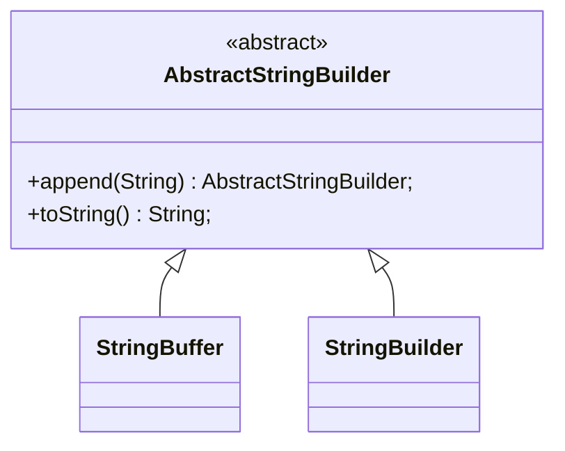

# 简介

`StringBuffer` 与 `StringBuffer` 都是 `AbstractStringBuilder` 的子类。

核心的功能都是在 `AbstractStringBuilder` 中实现的。

- `StringBuilder` 直接使用父类的方法，线程不安全。

- `StringBuffer` 中每个操作加了 `synchronized` 锁。

由于使用时，极少有需要保证字符串拼接线程安全的场景，所以在 JDK 1.5 中加入了 `StringBuilder`。



# append()

```java
public AbstractStringBuilder append(String str) {
    if (str == null) {
        return appendNull();
    }
    int len = str.length();
  	// 确保容量放得下加入的 str。
    ensureCapacityInternal(count + len);
    putStringAt(count, str);
    count += len;
    return this;
}

private void ensureCapacityInternal(int minimumCapacity) {
    // overflow-conscious code
    int oldCapacity = value.length >> coder;
  	// 如果字节数组长度不能放得下新加入的 str，扩容到可以放得下的容量。
    if (minimumCapacity - oldCapacity > 0) {
        value = Arrays.copyOf(value,
                newCapacity(minimumCapacity) << coder);
    }
}

private final void putStringAt(int index, String str) {
    if (getCoder() != str.coder()) {
        inflate();
    }
    str.getBytes(value, index, coder);
}
```

1. 使用字节数组缓存字符串。默认容量是 16。
2. 扩容，知道字节数组可以存的下新加入的 `str`。
3. 把新加入的 `str` 拷贝到字节数组的对应的位置。

# toString()

```java
// StringBuffer
public synchronized String toString() {
    if (toStringCache == null) {
        return toStringCache =
                isLatin1() ? StringLatin1.newString(value, 0, count)
                           : StringUTF16.newString(value, 0, count);
    }
    return new String(toStringCache);
}

// StringBuilder
public String toString() {
    // Create a copy, don't share the array
    return isLatin1() ? StringLatin1.newString(value, 0, count)
                      : StringUTF16.newString(value, 0, count);
}

// StringUTF16
public static String newString(byte[] val, int index, int len) {
    if (String.COMPACT_STRINGS) {
        byte[] buf = compress(val, index, len);
        if (buf != null) {
            return new String(buf, LATIN1);
        }
    }
    int last = index + len;
    return new String(Arrays.copyOfRange(val, index << 1, last << 1), UTF16);
}

// String
String(byte[] value, byte coder) {
    this.value = value;
    this.coder = coder;
}
```

- `StringBuffer` 会缓存 `toString()` 的结果。
- `StringBuilder` 不会缓存。

- 两者都是调用 `StringUTF16.newString()` 实现的。
  - 拷贝字节数组的缓存到创建的字符串。
  - 指定编码方式。

