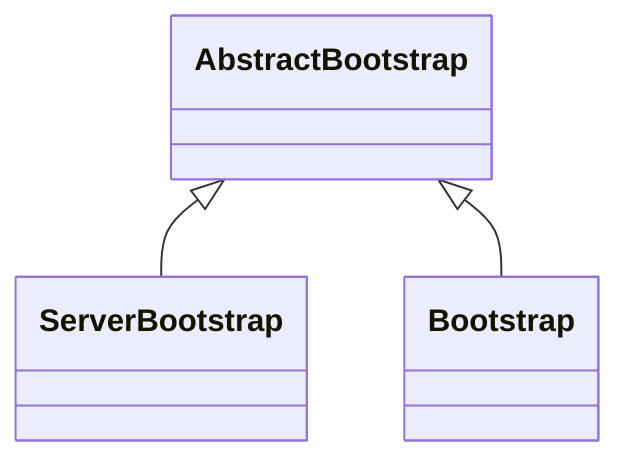

# 引用

- [Netty 源码（一）服务端启动](https://www.cnblogs.com/binarylei/p/10040765.html)

# 类的继承关系

- 服务端使用 `ServerBootstrap` 启动服务。

- 客户端使用 `Bootstrap` 连接服务端。

类的继承关系如下：




# 参数配置

```java
ServerBootstrap bootstrap = new ServerBootstrap();
EventLoopGroup bossGroup = new NioEventLoopGroup(2);
EventLoopGroup workerGroup = new NioEventLoopGroup();
bootstrap
  // 线程池
  .group(bossGroup, workerGroup)
  // 指定 Channel 的实现类
  .channel(NioServerSocketChannel.class)
  // 处理连接事件
  .handler(new LoggerHandler())
  // 处理读写事件
  .childHandler(new ChannelInitializer<SocketChannel>() {
    @Override
    protected void initChannel(SocketChannel ch) throws Exception {
      ch.pipeline()
        .addLast(new EchoServerHandler());
    }
  });
```

## 设置线程池

设置 `bossGroup` 和 `workerGroup`。

- `bossGroup` 存储在 `ServerBootstrap` 中 。来处理连接事件。
- `workerGroup` 存储在父类中。来处理读写事件、具体任务。

如果只传入一个 group，则共用一个线程池。

```java
// class ServerBootstrap
@Override
public ServerBootstrap group(EventLoopGroup group) {
    return group(group, group);
}
public ServerBootstrap group(EventLoopGroup parentGroup, EventLoopGroup childGroup) {
    super.group(parentGroup);
    // 省略 ...
    this.childGroup = childGroup;
    return this;
}

// class AbstractBootstrap
public B group(EventLoopGroup group) {
  /// 省略...
  this.group = group;
  return self();
}
```

`NioEventLoopGroup ` 会创建一个 `SelectorProvider`，用于接收特定的事件。

```java
// 默认 CPUS * 2 个线程。
public NioEventLoopGroup() {
  this(0);
}

public NioEventLoopGroup(int nThreads) {
  this(nThreads, (Executor) null);
}

public NioEventLoopGroup(int nThreads, Executor executor) {
  this(nThreads, executor, SelectorProvider.provider());
}
```

## 设置 Channel

根据给定的 `Channel` 的实现类型，创建工厂对象，之后创建 channel 对象时使用这个实现类型创建。

```java
public abstract class AbstractBootstrap
  <B extends AbstractBootstrap<B, C>, C extends Channel> implements Cloneable {
  
  // C 是 Channel 的子类
  public B channel(Class<? extends C> channelClass) {
      // 省略...
      return channelFactory(new ReflectiveChannelFactory<C>(channelClass));
  }

  // bind 方法时会用反射创建对应的 channel
  public B channelFactory(ChannelFactory<? extends C> channelFactory) {
      // 省略...
      this.channelFactory = channelFactory;
      return self();
  }
}
```

## 设置 Handler

`Channel` 处理连接事件。

存储在 `AbstractBootstrap` 的域中。

```java
// class AbstractBootstrap
public B handler(ChannelHandler handler) {
    if (handler == null) {
        throw new NullPointerException("handler");
    }
    this.handler = handler;
    return self();
}
```

## 设置 ChildHandler

`ChildHandler` 处理读写事件。

存储在 `ServerBootstrap` 的域中。

```java
// class ServerBootstrap
public ServerBootstrap childHandler(ChannelHandler childHandler) {
    if (childHandler == null) {
        throw new NullPointerException("childHandler");
    }
    this.childHandler = childHandler;
    return this;
}
```

# 启动服务

##  bind()

```java
// class AbstractBootstrap
public ChannelFuture bind(SocketAddress localAddress) {
  validate();
  if (localAddress == null) {
    throw new NullPointerException("localAddress");
  }
  return doBind(localAddress);
}
private ChannelFuture doBind(final SocketAddress localAddress) {
    // 1. 创建 channel，将其绑定到 EventLoopGroup 上。
    final ChannelFuture regFuture = initAndRegister();
    final Channel channel = regFuture.channel();
    if (regFuture.cause() != null) {
        return regFuture;
    }

    if (regFuture.isDone()) {
        // At this point we know that the registration was complete and successful.
        ChannelPromise promise = channel.newPromise();
        // 2. 如果已经注册成功了。同步绑定端口、启动服务。
      	doBind0(regFuture, channel, localAddress, promise);
        return promise;
    } else {
      	// 3. 如果还没有注册好，异步同步绑定端口、启动服务。
        final PendingRegistrationPromise promise = new PendingRegistrationPromise(channel);
        regFuture.addListener(new ChannelFutureListener() {
            @Override
            public void operationComplete(ChannelFuture future) throws Exception {
                Throwable cause = future.cause();
                if (cause != null) {
                    // Registration on the EventLoop failed so fail the ChannelPromise directly to not cause an
                    // IllegalStateException once we try to access the EventLoop of the Channel.
                    promise.setFailure(cause);
                } else {
                    // Registration was successful, so set the correct executor to use.
                    // See https://github.com/netty/netty/issues/2586
                    promise.registered();

                    doBind0(regFuture, channel, localAddress, promise);
                }
            }
        });
        return promise;
    }
}
```

注册的时候，如果当前线程是 EventLoop 的线程，则直接同步注册，否则放入 EventLoop 中异步注册。

```java
public final void register(EventLoop eventLoop, final ChannelPromise promise) {
    // 省略...
    AbstractChannel.this.eventLoop = eventLoop;
    // 同一个 channel 的注册、读、写等都在 eventLoop 完成，避免多线程的锁竞争
    if (eventLoop.inEventLoop()) {
        // 将 channel 注册到 eventLoop 上
        register0(promise);
    } else {
        try {
            eventLoop.execute(new Runnable() {
                @Override
                public void run() {
                    register0(promise);
                }
            });
        } catch (Throwable t) {
            // 省略...
        }
    }
}
```

## initAndRegister()

```java
// class AbstractBootstrap
final ChannelFuture initAndRegister() {
    Channel channel = null;
    try {
      	// 1. 创建一个 socket 的封装的 NioServerSocketChannel。
        channel = channelFactory.newChannel();
      	// 2. 配置参数、绑定自定义 handler、绑定 AcceptorHandler。
        init(channel);
    } catch (Throwable t) {
        if (channel != null) {
            channel.unsafe().closeForcibly();
            return new DefaultChannelPromise(channel, GlobalEventExecutor.INSTANCE).setFailure(t);
        }
        return new DefaultChannelPromise(new FailedChannel(), GlobalEventExecutor.INSTANCE).setFailure(t);
    }

    // 3. 将 channel 注册到 EventLoopGroup 上 
    //    a. 将 channel 绑定到 group 中的一个 EventLoop 上。（channel.eventLoop)。
    //    b. goup 的 selector 上，监听 `OP_ACCEPT` 事件。
    ChannelFuture regFuture = config().group().register(channel);
    if (regFuture.cause() != null) {
        if (channel.isRegistered()) {
            channel.close();
        } else {
            channel.unsafe().closeForcibly();
        }
    }

    return regFuture;
}
```

### channelFactory.newChannel()

`channelFactory.newChannel()` 使用反射，构造之前设置的 `channel` 类的对象。

- `NioServerSocketChannel` 调用 `java.nio` 包，创建一个 socket（类型为 `java.nio.channels. ServerSocketChannel`）。

```java
// class NioServerSocketChannel
private static final SelectorProvider DEFAULT_SELECTOR_PROVIDER = SelectorProvider.provider();
public NioServerSocketChannel() {
  this(newSocket(DEFAULT_SELECTOR_PROVIDER));
}
private static ServerSocketChannel newSocket(SelectorProvider provider) {
  return provider.openServerSocketChannel();
}
public NioServerSocketChannel(ServerSocketChannel channel) {
  super(null, channel, SelectionKey.OP_ACCEPT);
  config = new NioServerSocketChannelConfig(this, javaChannel().socket());
}


// 设置成非阻塞模式，并注册感兴趣的事件。
protected AbstractNioChannel(Channel parent, SelectableChannel ch, int readInterestOp) {
    super(parent);
    this.ch = ch;
    this.readInterestOp = readInterestOp;
    ch.configureBlocking(false);
}

// 创建 channel 是创建对应的 pipeline。
protected AbstractChannel(Channel parent) {
    this.parent = parent;
    id = newId();
    unsafe = newUnsafe();
    pipeline = newChannelPipeline();
}
```

###  init()

```java
// class ServerBootstrap
@Override
void init(Channel channel) throws Exception {
    // 1. 设置参数
    final Map<ChannelOption<?>, Object> options = options0();
    synchronized (options) {
        setChannelOptions(channel, options, logger);
    }

    final Map<AttributeKey<?>, Object> attrs = attrs0();
    synchronized (attrs) {
        for (Entry<AttributeKey<?>, Object> e: attrs.entrySet()) {
            @SuppressWarnings("unchecked")
            AttributeKey<Object> key = (AttributeKey<Object>) e.getKey();
            channel.attr(key).set(e.getValue());
        }
    }

    ChannelPipeline p = channel.pipeline();

    final EventLoopGroup currentChildGroup = childGroup;
    final ChannelHandler currentChildHandler = childHandler;
    final Entry<ChannelOption<?>, Object>[] currentChildOptions;
    final Entry<AttributeKey<?>, Object>[] currentChildAttrs;
    synchronized (childOptions) {
        currentChildOptions = childOptions.entrySet().toArray(newOptionArray(childOptions.size()));
    }
    synchronized (childAttrs) {
        currentChildAttrs = childAttrs.entrySet().toArray(newAttrArray(childAttrs.size()));
    }

    p.addLast(new ChannelInitializer<Channel>() {
        @Override
        public void initChannel(final Channel ch) throws Exception {
            final ChannelPipeline pipeline = ch.pipeline();
            // 2. 应用 bootstrap.handler() 传入的 handler。
            ChannelHandler handler = config.handler();
            if (handler != null) {
                pipeline.addLast(handler);
            }
            // 3. 将接收客户端的 ServerBootstrapAcceptor 注册到 pipeline 中
            ch.eventLoop().execute(new Runnable() {
                @Override
                public void run() {
                    pipeline.addLast(new ServerBootstrapAcceptor(
                            ch, currentChildGroup, currentChildHandler, currentChildOptions, currentChildAttrs));
                }
            });
        }
    });
}
```


