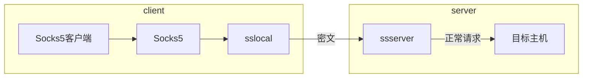

# 引用
- [彻底理解正向代理、反向代理、透明代理](https://zhuanlan.zhihu.com/p/68560128)
- [正向代理与反向代理](https://foofish.net/proxy-and-reverse-proxy.html)
- [Shadowsocks原理详解](http://peachey.blog/2017/12/28/py-shadowsocks/#2-Shadowsocks-Socks-5工作原理)
- [HTTP协议和SOCKS5协议](https://www.cnblogs.com/yinzhengjie/p/7357860.html)

# 正向代理

正向代理代理的是客户端，客户端把**所有**的请求都交给代理服务器，由代理服务器代替客户端去请求。服务端并不知道真正的客户端是谁，**对server透明**。例如shadowsocks使用socks5协议。

# 反向代理

反向代理代理的是服务端，对于**某一种**服务，客户端向代理服务器发送请求，由代理服务器代替客户端去请求。客户端并不知道后边真正是谁服务的，**对client透明**。例如nginx来负载均衡和代理转发。

# 透明代理

透明代理的意思是客户端根本不需要知道有代理服务器的存在，它改编你的request fields（报文），并会传送真实IP。注意，加密的透明代理则是属于匿名代理，意思是不用设置使用代理了。

透明代理实践的例子就是时下很多公司使用的行为管理软件

# Socks5 协议

Shadowsocks的处理方式是将Socks 5客户端与Socks5服务器的连接提前，Socks5协议的交互完全是在本地进行的，在网络中传输的完全是利用加密算法加密后的密文，这就很好的进行了去特征化，使得传输的数据不是很容易的被特征识别，本人认为这是Shadowsocks的最大的创新了，具体的流程如下：

socks5本身只是个代理提供转发，不提供加密的功能，所以不提供安全性，安全性只能由客户端自己提供，比如如果客户端使用SSL, 那么该网络连接就有了安全性。？

